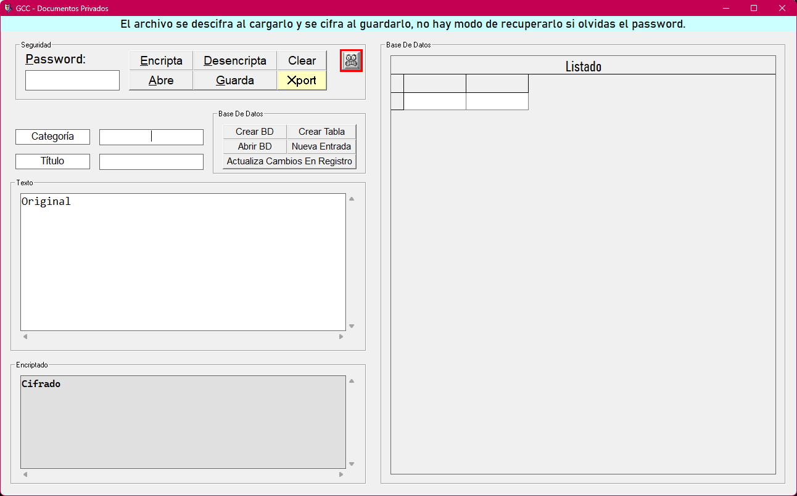

# Kripto 🔐

**Kripto** is a simple, portable VB6-based encryption tool designed for secure, offline data storage. It runs directly from a USB stick and creates its own encrypted database wherever it's launched—no installation, no trace.

---

## 🧩 What It Does

- Prompts for a **master password** to create a secure Access 2012 database (`Kripto.accdb`)
- Asks for a **user name** and creates the initial user record
- Requests a **second password** for encryption/decryption operations
- Creates two tables:
  - `Agents`
  - `TopSecret`
- Offers a form-based UI with buttons to:
  - Create new database
  - Open existing database
  - View and edit tables
  - Add/update records
  - Encrypt or decrypt data
  - Save encrypted or decrypted files locally

---

## 🧠 Data Structure

Each record stores:
- **Category** (e.g. Finance, Health, Legal)
- **Type** (e.g. Bank, Insurance, Contact)
- **Data** (free-form text: account numbers, names, phones, etc.)

Example:
Category: Finance Type: BNMX Data: suc. 134, cta. 12345, CLABE: 1234567585858, Executive: John Lord, Tel: 2345678478 xtn 4345, Xal. Ver, MX

---

## 🧳 Portability

Kripto is designed to run from a USB stick. It looks for the database in the same directory where it's executed, allowing you to carry your encrypted data with you—quietly and securely.

---

## ⚙️ Tech Stack

- VB6 (Visual Basic 6.0)
- Access 2012 (`.accdb`)
- Local encryption routines (modular, legacy-friendly)

---

## 🧭 Philosophy

No fancy UI. No cloud. Just a boring, useful tool that protects your data and respects your autonomy.

---

## 🛡️ Status

**Stable. Personal use. Legacy-friendly.**  
Future updates may include modular validators, export routines, and documentation enhancements.

---

